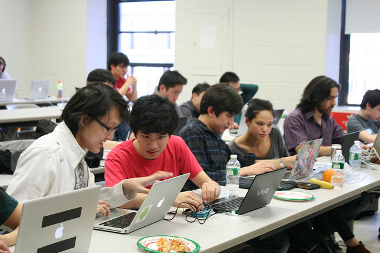

:Title: About
:URL:
:save_as: index.html

Australian MIcrobial GenOmics Symposium (AMIGOS) is a gathering of 
approximately 45 researchers working in Australia in the field of Microbial 
Genomics.

AMIGOS will:
    * Improve communication between Microbial Genomics groups within Australia,
    * define current & future problems in Microbial Genomics,
    * form focus groups based on problems/themes and begin working together on 
      solutions, and,
    * report solutions back to all other groups and plan for the future.

The first AMIGOS is being held_ 14-16 April 2015 in the picturesque surrounds 
of Sydney's Chowder Bay.

The inaugural AMIGOS program_ is loosely based around the the 
Unconference/Unseminar/Hackathon/Startup Weekend models. A pre-symposium 
survey_ has been developed to help shape the event.

|
|

.. _held: http://theamigos.space/pages/venue.html
.. _program: http://theamigos.space/pages/program.html
.. _survey: http://theamigos.space/pages/survey.html
